<h2>TensorFlow-FlexUNet-Image-Segmentation-Crystal-Clean-Brain-Tumor (2026/06/23)</h2>
Sarah T.  Arai 
Software Laboratory antillia.com  
This is the first experiment of Image Segmentation for <b>Crystal-Clean-Brain-Tumor</b> based on our <a href="./src/TensorFlowFlexUNet.py">TensorFlowFlexUNet</a> 
(TensorFlow Flexible UNet Image Segmentation Model for Multiclass) , 
and a 256x256 pixels PNG
<a href="https://drive.google.com/file/d/1VSlBczPJQi2K8TqHYsFoJgcTMy-HY5lc/view?usp=sharing">
<b>Crystal-Clean-Brain-Tumor-ImageMask-Dataset.zip</b></a> with colorized masks 
(<a href="https://creativecommons.org/publicdomain/zero/1.0/">CC0: Public Domain</a>), which was derived by us from   
<a href="https://www.kaggle.com/datasets/mohammadhossein77/brain-tumors-dataset">
<b>Crystal Clean: Brain Tumors MRI Dataset</b> </a> by MH(mohammadhossein77).
  

<b>Actual Image Segmentation for Crystal-Clean-Brain-Tumor Images of 256x256 pixels </b> 
As shown below, the inferred masks predicted by our segmentation model trained by the dataset appear similar to the ground truth masks.
  
<b>class_color_map = {Meningioma:blue, Glioma:green, Pituitary tumor:red}
</b>
  
<table>
<tr>
<th>Input: image</th>
<th>Mask (ground_truth)</th>
<th>Prediction: inferred_mask</th>
</tr>
<tr>
<td>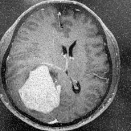</td>
<td>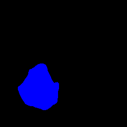</td>
<td>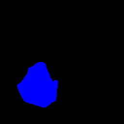</td>
</tr>
<tr>
<td>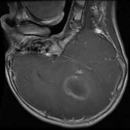</td>
<td>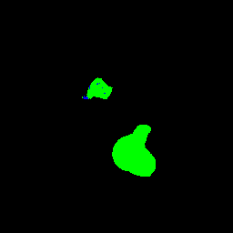</td>
<td>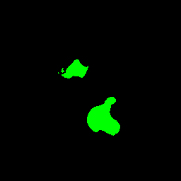</td>
</tr>
<tr>
<td>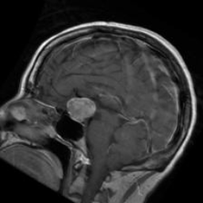</td>
<td></td>
<td></td>
</tr>
</table>

 
<h3>1  Dataset Citation</h3>
The dataset used here was derived from   
<a href="https://www.kaggle.com/datasets/mohammadhossein77/brain-tumors-dataset">
<b>Crystal Clean: Brain Tumors MRI Dataset</b> </a>.
  
The following explanation was taken from above web site.
  
<b>About Dataset</b> 
<b>Uncovering Knowledge: A Clean Brain Tumor Dataset for Advanced Medical Research</b> 
 
<b>Introduction</b> 
<ul>
<li>This dataset, available in RAR archive format, 
consists of four classes, including three tumor classes (Pituitary, Glioma and Meningioma) and one class representing normal brain MRI scans.
</li>
<li>
The strength of this dataset in comparison with other releases across the Kaggle is the cleanness of data. 
In this regard, we subjected the initial dataset to a meticulous data cleaning pipeline. 
This pipeline involved several steps aimed at enhancing the dataset's integrity and usability.
</li>
<li>
The initial data source for this dataset is the brain tumor classification MRI dataset, which can be accessed at 
this <a href="https://www.kaggle.com/datasets/sartajbhuvaji/brain-tumor-classification-mri">link</a>.
</li>
</ul>
 
<b>Data Cleaning Process:</b> 
<ul>
<li><b>Removal of Duplicate Samples:</b>We employed an image vector comparison method to identify and remove duplicate samples, 
ensuring that each data point is unique.</li>
<li><b>Correction of Mislabeled Images:</b>Using our domain knowledge, we carefully inspected and corrected falsely 
labeled images, ensuring that they were appropriately categorized. 
This step greatly enhances the accuracy of the dataset.</b></li>
<li><b>Image Resizing:</b> All images in the dataset were resized to a memory-efficient yet academically accepted size of (224, 224), 
facilitating easier processing and analysis.</li>
</ul>
<b>Statistics</b> 
<ul>
<li>Normal: 500</li>
<li>Glioma: 926</li>
<li>Meningioma: 937</li>
<li>Pituitary: 901</li>
</ul>
 
After applying the data cleaning pipeline, the number of samples in each category decreased on average by approximately 3-9%.  
This reduction ensures the data integrity while maintaining a sufficient number of samples for comprehensive analysis.
  
<b>Acknowledgement</b> 
<ul>
<li>We would like to express our sincere gratitude to the original dataset publisher, 
<a href="https://www.kaggle.com/sartajbhuvaji">sartajbhuvaji</a>, for their valuable contribution.</li>
<li>This dataset is released under the CC0 license, making it open and accessible for everyone to use. 
While not mandatory, citing the dataset would be greatly appreciated.</li>
</ul>
 
<b>Important Note</b> 
Those researchers who want to use this dataset for real world use cases, must consult with medical field experts (radiologists, …) 
on the ground truth of the labels and their usability for their angle of research.
  
<b>License:</b> 
<a href="https://creativecommons.org/publicdomain/zero/1.0/">CC0: Public Domain</a>
  

<h3>
2 Crystal-Clean-Brain-Tumor ImageMask Dataset
</h3>
<h3>
2.1 Download ImageMask Dataset
</h3>
 If you would like to train this Crystal-Clean-Brain-Tumor Segmentation model by yourself,
please down load our dataset <a href="https://drive.google.com/file/d/1VSlBczPJQi2K8TqHYsFoJgcTMy-HY5lc/view?usp=sharing">
<b>Crystal-Clean-Brain-Tumor-ImageMask-Dataset.zip</b>
(<a href="https://creativecommons.org/publicdomain/zero/1.0/">CC0: Public Domain</a>)
</a> on the google drive,
expand the downloaded, and put it under <b>./dataset/</b> to be.
<pre>
./dataset
└─Crystal-Clean-Brain-Tumor
    ├─test
    │   ├─images
    │   └─masks
    ├─train
    │   ├─images
    │   └─masks
    └─valid
        ├─images
        └─masks
</pre>
 
<b>Crystal-Clean-Brain-Tumor Statistics</b> 
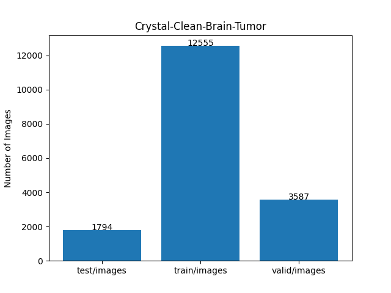 
 
As shown above, the number of images of train and valid datasets is large enough to use for a training set of our segmentation model.
  
<h3>
2.2 Derivation of Crystal-Clean-Brain-Tumor Dataset
</h3>
The folder structure of the <b>Crystal-Clean-Brain-Tumor/Data</b>  is the following,
but it contains no annotation(mask) files,because it is an image classification dataset. 
<pre>
./Data
  ├─Normal
  │   ├─N_1.jpg
...
  │   └─N_438_VF_.jpg
  │
  └─Tumor
       ├─glioma_tumor
       │   ├─G_1.jpg
...
            └─G_901_VF_.jpg
       │            
       ├─meningioma_tumor
       │   ├─M_1.jpg
...
            └─M_913_VF_.jpg
       │
       └─pituitary_tumor
            ├─P_1.jpg
...
            └─P_844_VF_.jpg
</pre>
<b>Step 1</b> 
We generated a 256x256 pixsels PNG master Tumor dataset from the JPG files under all sub folders of <b>Tumor</b>.
  
<b>Step 2</b> 
We generated the first reference mask files corresponding to the master images 
by applying an inference (segmentation) method of
a pretrained FlexUNet model <a href="https://github.com/sarah-antillia/TensorFlow-FlexUNet-Image-Segmentation-BRISC2025-BrainTumor">
TensorFlow-FlexUNet-Image-Segmentation-BRISC2025-BrainTumor
</a> to all master Tumor images.
  
<b>Step 3</b> 
We generated the first ImageMask Dataset by excluding unappropriate pairs of Tumor images and the first reference masks.
  
<b>Step 4</b> 
We generated the second reference mask files corresponding to the master images 
by applying an inference (segmentation) method of
a pretrained FlexUNet model trained by the first ImageMask Dataset to all master Tumor images.
  
<b>Step 5</b> 
We finally generated a curated ImageMask Dataset from the pairs of master images and the second reference masks, 
by excluding all black empty masks and their corresponding master images.
  
<h3>
2.3 Train Sample Images and Masks
</h3>
<b>Train_sample images</b> 
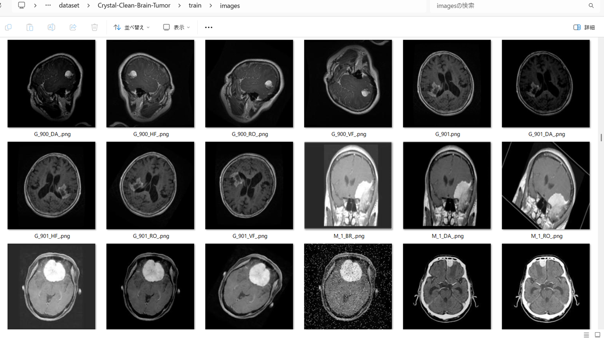
 
<b>Train_sample_masks</b> 
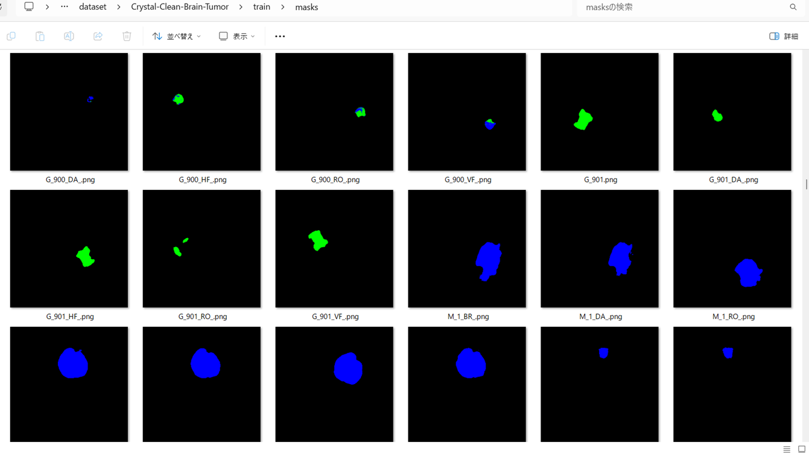
 
<h3>
3 Train TensorflowFlexUNet Model
</h3>
 We trained Crystal-Clean-Brain-Tumor TensorflowFlexUNet Model by using the 
<a href="./projects/TensorFlowFlexUNet/Crystal-Clean-Brain-Tumor/train_eval_infer.config"> <b>train_eval_infer.config</b></a> file.  
Please move to ./projects/TensorFlowFlexUNet/Crystal-Clean-Brain-Tumor and run the following bat file. 
<pre>
>1.train.bat
</pre>
, which simply runs the following command. 
<pre>
>python ../../../src/TensorFlowFlexUNetTrainer.py ./train_eval_infer.config
</pre>

<b>Model parameters</b> 
Defined a small <b>base_filters=16</b> and a large <b>base_kernels=(9,9)</b> for the first Conv Layer of Encoder Block of 
<a href="./src/TensorFlowFlexUNet.py">TensorFlowFlexUNet.py</a> 
and a large <b>num_layers=8</b> (including a bridge between Encoder and Decoder Blocks).
<pre>
[model]
image_width    = 256
image_height   = 256
image_channels = 3
input_normalize = True
normalization  = False
num_classes    = 4
base_filters   = 16
base_kernels  = (9,9)
num_layers    = 8
dropout_rate   = 0.05
dilation       = (1,1)
</pre>

<b>Learning rate</b> 
Defined a small learning rate.  
<pre>
[model]
learning_rate  = 0.00007
</pre>

<b>Loss and metrics functions</b> 
Specified "categorical_crossentropy" and "dice_coef_multiclass". 
<pre>
[model]
loss           = "categorical_crossentropy"
metrics        = ["dice_coef_multiclass"]
</pre>
<b >Learning rate reducer callback</b> 
Enabled learing_rate_reducer callback, and a small reducer_patience.
<pre> 
[train]
learning_rate_reducer = True
reducer_factor     = 0.5
reducer_patience   = 4
</pre>
<b>Early stopping callback</b> 
Enabled early stopping callback with patience parameter.
<pre>
[train]
patience      = 10
</pre>
<b></b> 
<b>RGB color map</b> 
rgb color map dict for Crystal-Clean-Brain-Tumor 1+3 classes. 
<pre>
[mask]
mask_file_format = ".png"
;Crystal-Clean-Brain-Tumor 1+3
;                  Meningioma:blue, Glioma:green, Pituitary tumor:red      
rgb_map = {(0,0,0):0, (0,0,255):1, (0,255,0):2, (255,0,0):3,}       
</pre>
<b>Epoch change inference callbacks</b> 
Enabled epoch_change_infer callback. 
<pre>
[train]
epoch_change_infer       = True
epoch_change_infer_dir   =  "./epoch_change_infer"
epoch_changeinfer        = False
epoch_changeinfer_dir    = "./epoch_changeinfer"
num_infer_images         = 6
</pre>
By using this epoch_change_infer callback, on every epoch_change, the inference procedure can be called
 for 6 images in <b>mini_test</b> folder. This will help you confirm how the predicted mask changes 
 at each epoch during your training process.    
<b>Epoch_change_inference output at starting (1,2,3)</b> 
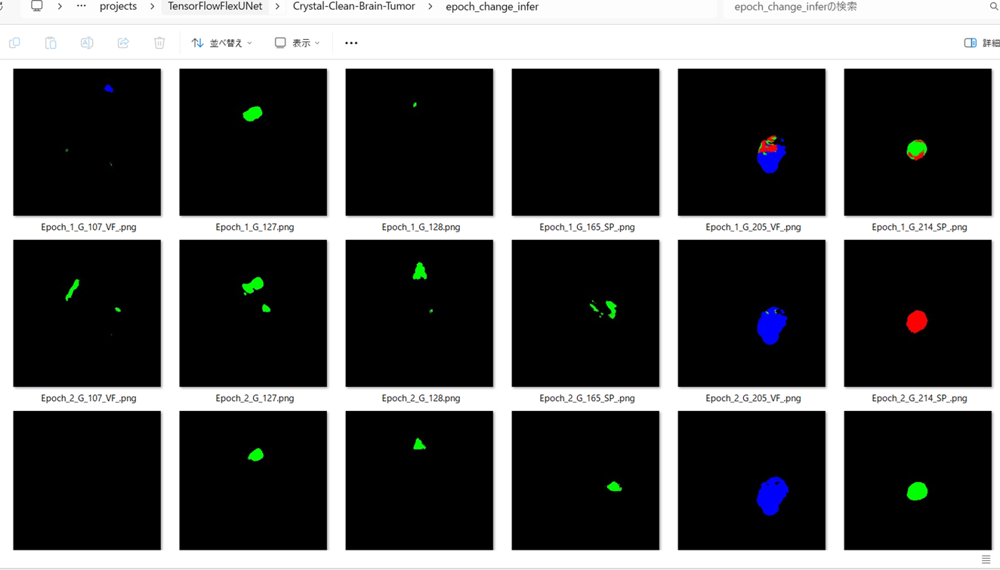 
 
<b>Epoch_change_inference output at middle-point (18,19,20)</b> 
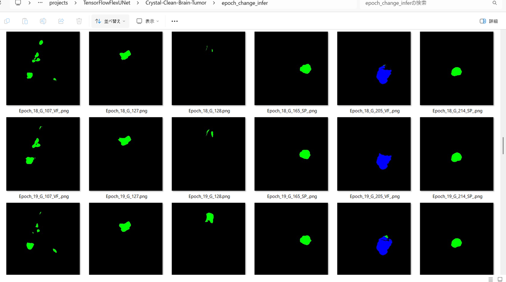 
 
<b>Epoch_change_inference output at ending (37,38,39)</b> 
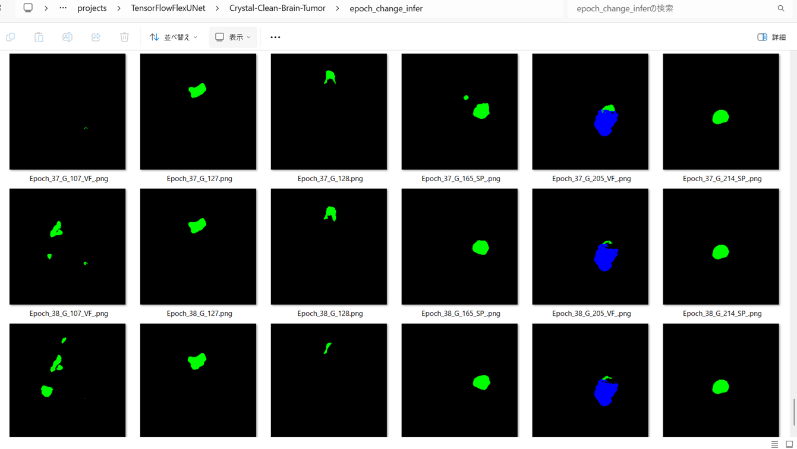 

 
In this experiment, the training process was stopped at epoch 39 by EarlyStoppingCallback.  
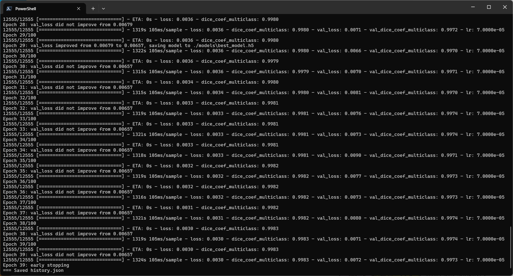 
 
<a href="./projects/TensorFlowFlexUNet/Crystal-Clean-Brain-Tumor/eval/train_metrics.csv">train_metrics.csv</a> 
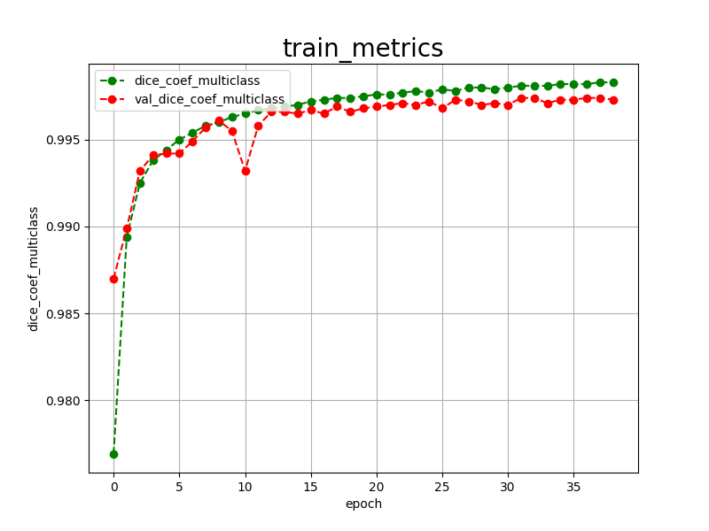 

 
<a href="./projects/TensorFlowFlexUNet/Crystal-Clean-Brain-Tumor/eval/train_losses.csv">train_losses.csv</a> 
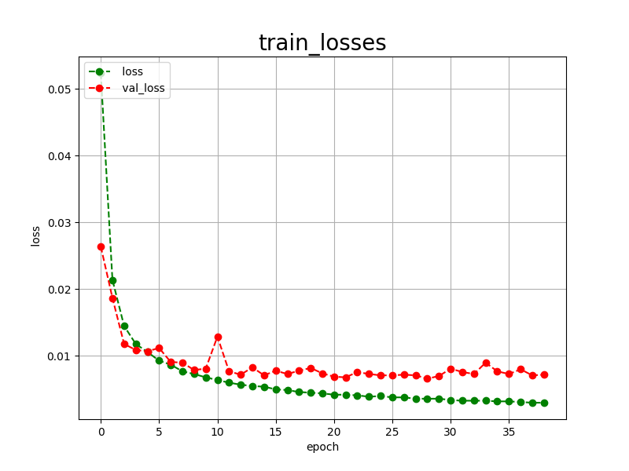 
 
<h3>
4 Evaluation
</h3>
Please move to a <b>./projects/TensorFlowFlexUNet/Crystal-Clean-Brain-Tumor</b> folder,
and run the following bat file to evaluate TensorflowFlexUNet model for Crystal-Clean-Brain-Tumor. 
<pre>
>./2.evaluate.bat
</pre>
This bat file simply runs the following command.
<pre>
>python ../../../src/TensorFlowFlexUNetEvaluator.py  ./train_eval_infer.config
</pre>
Evaluation console output: 
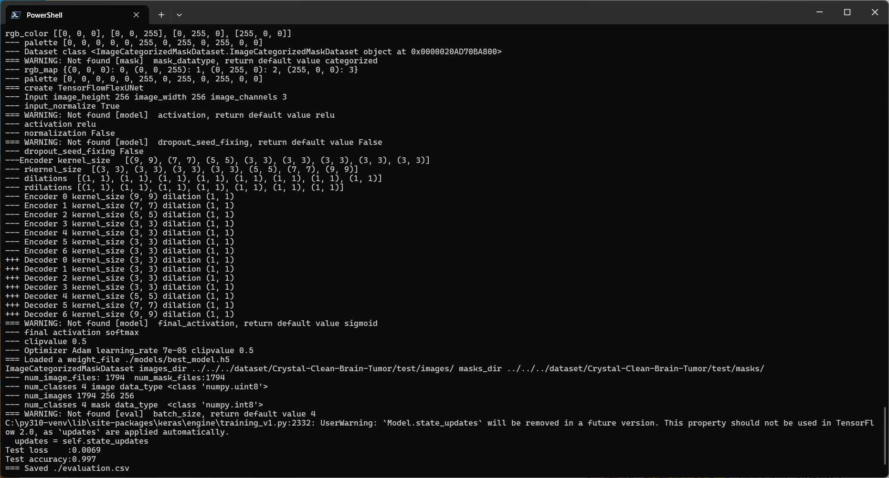
  Image-Segmentation-Crystal-Clean-Brain-Tumor

<a href="./projects/TensorFlowFlexUNet/Crystal-Clean-Brain-Tumor/evaluation.csv">evaluation.csv</a> 
The loss (categorical_crossentropy) to this Crystal-Clean-Brain-Tumor/test was very low, and dice_coef_multiclass 
very high as shown below.
 
<pre>
categorical_crossentropy,0.0069
dice_coef_multiclass,0.997
</pre>
 
<h3>5 Inference</h3>
Please move to a <b>./projects/TensorFlowFlexUNet/Crystal-Clean-Brain-Tumor</b> folder
, and run the following bat file to infer segmentation regions for images by the Trained-TensorflowFlexUNet model for Crystal-Clean-Brain-Tumor. 
<pre>
>./3.infer.bat
</pre>
This simply runs the following command.
<pre>
>python ../../../src/TensorFlowFlexUNetInferencer.py ./train_eval_infer.config
</pre>

<b>mini_test_images</b> 
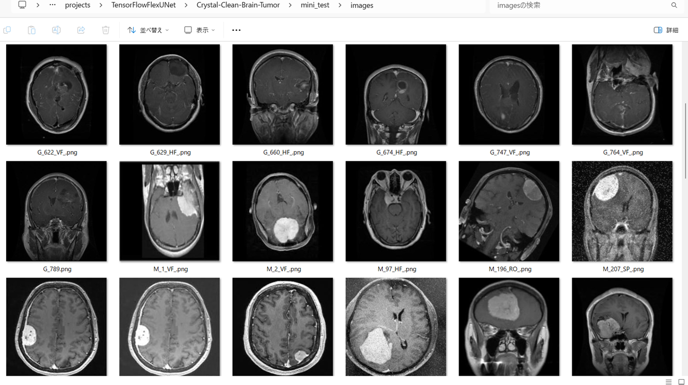 
<b>mini_test_mask(ground_truth)</b> 
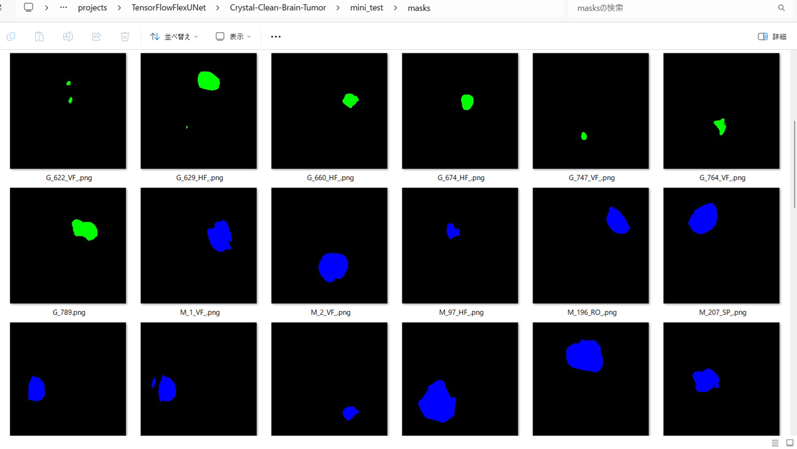 

<b>Inferred test masks</b> 
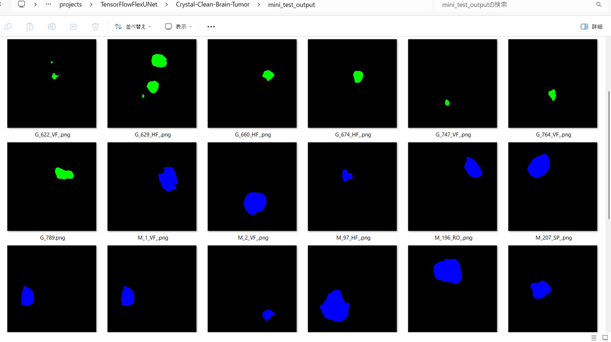 
 

<b>Enlarged images and masks for  Crystal-Clean-Brain-Tumor  Images of 256x256 pixels</b> 
As shown below, the inferred masks predicted by our segmentation model trained by the dataset appear similar to the 
ground truth masks,
  
<b>class_color_map = {Meningioma:blue, Glioma:green, Pituitary tumor:red}</b>
 
 
<table>
<tr>
<th>Input: image</th>
<th>Mask (ground_truth)</th>
<th>Prediction: inferred_mask</th>
</tr>
<tr>
<td>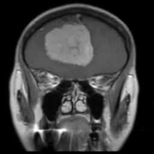</td>
<td></td>
<td>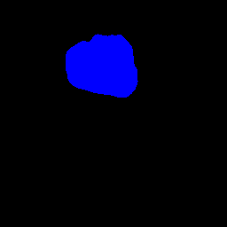</td>
</tr>

<tr>
<td>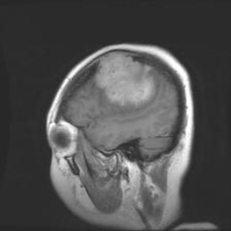</td>
<td>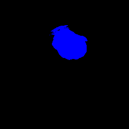</td>
<td></td>
</tr>

<tr>
<td>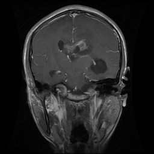</td>
<td>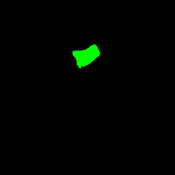</td>
<td>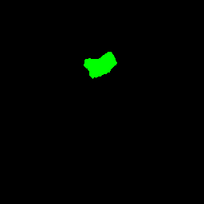</td>
</tr>
<tr>
<td>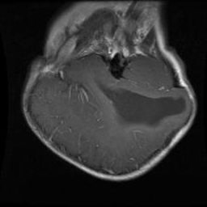</td>
<td>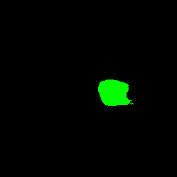</td>
<td>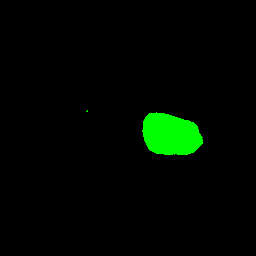</td>
</tr>
<tr>
<td>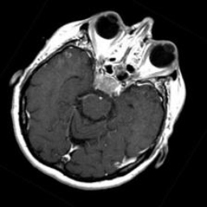</td>
<td>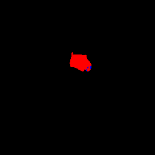</td>
<td></td>
</tr>
<tr>
<td>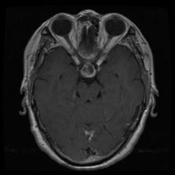</td>
<td>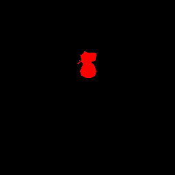</td>
<td>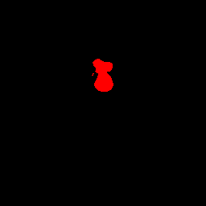</td>
</tr>
</table>

 
<h3>
References
</h3>
<b>1. TensorFlow-FlexUNet-Image-Segmentation-Figshare-BrainTumor</b> 
Toshiyuki Arai  
<a href="https://github.com/sarah-antillia/TensorFlow-FlexUNet-Image-Segmentation-Figshare-BrainTumor">
https://github.com/sarah-antillia/TensorFlow-FlexUNet-Image-Segmentation-Figshare-BrainTumor
</a>
 
 
<b>2. TensorFlow-FlexUNet-Image-Segmentation-BRISC2026-Brain-Tumor</b> 
Toshiyuki Arai  
<a href="https://github.com/sarah-antillia/TensorFlow-FlexUNet-Image-Segmentation-BRISC2026-Brain-Tumor">
https://github.com/sarah-antillia/TensorFlow-FlexUNet-Image-Segmentation-BRISC2026-Brain-Tumor
</a>
 
 
<b>3. TensorFlow-FlexUNet-Image-Segmentation-BRISC2025-BrainTumor</b> 
Toshiyuki Arai  
<a href="https://github.com/sarah-antillia/TensorFlow-FlexUNet-Image-Segmentation-BRISC2025-BrainTumor">
https://github.com/sarah-antillia/TensorFlow-FlexUNet-Image-Segmentation-BRISC2025-BrainTumor
</a>
 
 
<b>4. TensorFlow-FlexUNet-Image-Segmentation-Brain-Tumor-MRI </b> 
Toshiyuki Arai  
<a href="https://github.com/sarah-antillia/TensorFlow-FlexUNet-Image-Segmentation-Brain-Tumor-MRI">
https://github.com/sarah-antillia/TensorFlow-FlexUNet-Image-Segmentation-Brain-Tumor-MRI
</a>
 
 
<b>5. TensorFlow-FlexUNet-Image-Segmentation-Model</b> 
Toshiyuki Arai  
<a href="https://github.com/sarah-antillia/TensorFlow-FlexUNet-Image-Segmentation-Model">
TensorFlow-FlexUNet-Image-Segmentation-Model
</a>
 
 
